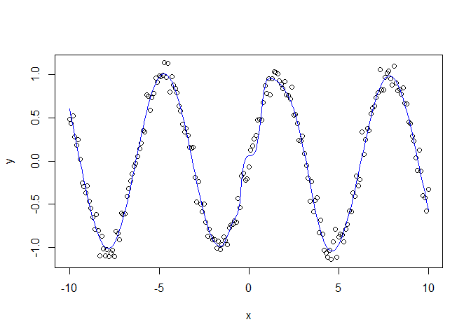

<!-- README.md is generated from README.Rmd. Please edit that file -->

# nnetLM

<!-- badges: start -->

[](https://github.com/umbe1987/nnetLM/actions/workflows/R-CMD-check.yaml)
<!-- badges: end -->

nnetLM provides is a Neural Network package that uses the
Levenberg-Marquardt algorithm provided in the minpack.lm package for
parameter optimization.

## Installation

You can install nnetLM like so:

``` r
install.packages("nnetLM")
```

or the development version like so:

``` r
devtools::install_github("umbe1987/nnetLM")
```

## Example

This example shows how to instantiate a basic network object, train it
using a dummy data set, and make predictions:

``` r
library(nnetLM)

set.seed(123)

x <- seq(-10, 10, by = 0.1)
y <- sin(x) + rnorm(length(x), mean = 0, sd = 0.1)
X <- matrix(x, nrow = length(x), ncol = 1)

plot(x, y)

hidden <- c(10)
actFn <- c("tanh", "linear")
nnet_obj <- nnetLM(X, y, hidden, actFn)

## perform fit
nnet_obj <- train.nnetLM(nnet_obj, 50)
#> Warning in nls.lm(par = parStart, fn = residFun, observed = object$y, xx = object$X, : lmdif: info = -1. Number of iterations has reached `maxiter' == 50.
pred.nnetLM <- predict(nnet_obj, X)

lines(x, pred.nnetLM, col = "blue")
```


